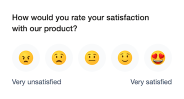
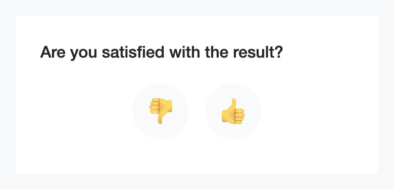
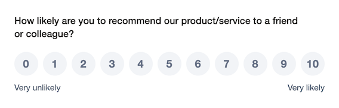
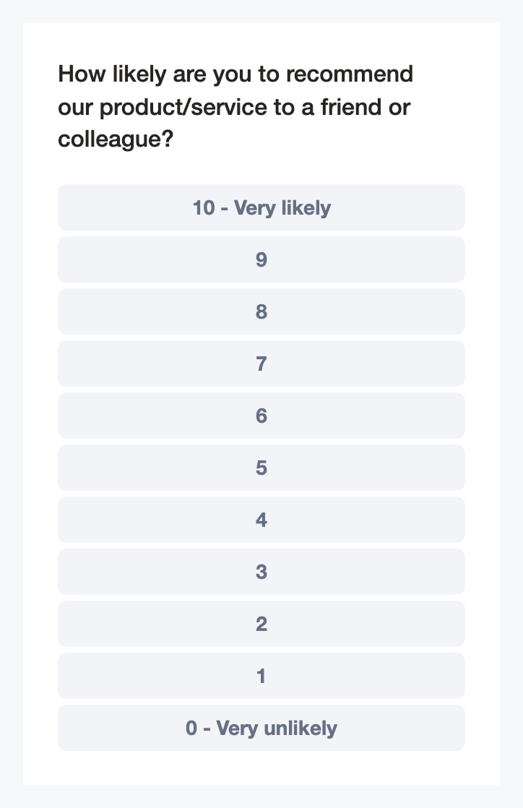
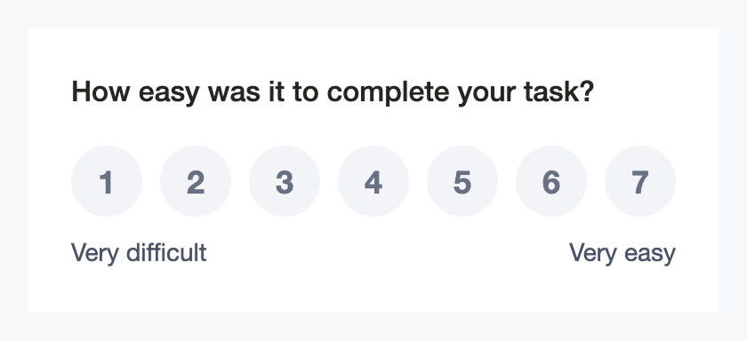
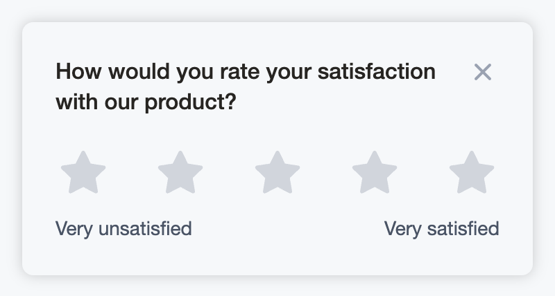

# react-feedback-surveys

[](https://www.npmjs.com/package/react-feedback-surveys)
[](https://www.npmjs.com/package/react-feedback-surveys)
[](https://github.com/feedback-tools-platform/react-feedback-surveys/blob/main/LICENSE)
[](https://bundlephobia.com/package/react-feedback-surveys)

> Lightweight, customizable survey widgets to collect user feedback in React apps.

## Table of Contents

- [Features](#features)
- [Survey Types](#survey-types)
- [Installation](#installation)
    * [1. Install](#1-install)
    * [2. Styles](#2-styles)
- [Survey Components](#survey-components)
    * [CSAT5 (Customer Satisfaction Score, 5-Point Scale)](#csat5-customer-satisfaction-score-5-point-scale)
    * [CSAT2 (Customer Satisfaction Score, 2-Point Scale)](#csat2-customer-satisfaction-score-2-point-scale)
    * [NPS10 (Net Promoter Score, 0–10 Scale)](#nps10-net-promoter-score-010-scale)
    * [CES7 (Customer Effort Score, 7-Point Scale)](#ces7-customer-effort-score-7-point-scale)
- [Layout Components](#layout-components)
    * [Popup](#popup)
    * [Surface](#surface)
- [Props](#props)
    * [Shared Props](#shared-props)
    * [Scale Style Options](#scale-style-options)
        + [CSAT2Survey](#csat2survey)
        + [CSAT5Survey](#csat5survey)
        + [CES7Survey](#ces7survey)
        + [NPS10Survey](#nps10survey)
- [Styling](#styling)
    * [CSS Variables](#css-variables)
    * [Custom Classes](#custom-classes)
- [Demo](#demo)
- [Contributing](#contributing)
    * [Local development (Storybook)](#local-development-storybook)
    * [Library build (watch mode)](#library-build-watch-mode)
    * [Production build](#production-build)
- [Roadmap](#roadmap)
- [Changelog](#changelog)
- [Credits](#credits)
- [License](#license)


## Features

- **Ready-to-use survey widgets** – CSAT (2 or 5 points), CES (7 points), NPS (0–10)
- **Multiple scale styles** – emoji, stars, numbers, thumbs
- **Flexible placement** – embed inline or display as popup overlay
- **Follow-up feedback** – optional text input or multiple choice responses
- **Fully customizable** – CSS variables and custom class names
- **Zero dependencies**
- **TypeScript support**

## Survey Types

- **CSAT (Customer Satisfaction Score):** 2-point (`csat2`) or 5-point (`csat5`) scales
- **NPS (Net Promoter Score):** 0–10 numeric scale (`nps10`)
- **CES (Customer Effort Score):** 7-point numeric scale (`ces7`)

## Installation

### 1) Install

```shell
npm i react-feedback-surveys
# or
yarn add react-feedback-surveys
```

### 2) Styles

```tsx
import 'react-feedback-surveys/index.css';
```

## Survey Components

### CSAT5 (Customer Satisfaction Score, 5-Point Scale)

Surveys to ask users about their overall satisfaction.

**Example questions:**
- "How satisfied are you with our product?"
- "How would you rate your overall experience?"
- "How satisfied are you with our customer support?"



```tsx
import { CSAT5Survey } from 'react-feedback-surveys';
import 'react-feedback-surveys/index.css';

<CSAT5Survey
  scaleStyle="emoji"
  question="How would you rate your satisfaction with our product?"
  minLabel="Very unsatisfied"
  maxLabel="Very satisfied"
  responseType="text"
  textQuestion="We'd love to hear your thoughts — what can we improve?"
  textButtonLabel="Send"
  thankYouMessage="Thanks for your feedback!"
  onScoreSubmit={({ value }) => {/* ... */}}
  onFeedbackSubmit={({ value, text }) => {/* ... */}}
/>
```

`scaleStyle`: `emoji` | `numbers` | `stars`.

### CSAT2 (Customer Satisfaction Score, 2-Point Scale)

Surveys to ask users about specific features or flows.

**Example questions:**
- "Was this search helpful?"
- "Did you find what you were looking for?"
- "Are you satisfied with the checkout process?"



```tsx
import { CSAT2Survey } from 'react-feedback-surveys';
import 'react-feedback-surveys/index.css';

<CSAT2Survey
  scaleStyle="thumbs"
  question="Are you satisfied with the result?"
  responseType="text"
  textQuestion="We'd love to hear your thoughts — what can we improve?"
  textButtonLabel="Send"
  thankYouMessage="Thank you for your feedback!"
  onScoreSubmit={({ value }) => {/* ... */}}
  onFeedbackSubmit={({ value, text }) => {/* ... */}}
/>
```

`scaleStyle`: `emoji` | `thumbs`.

### NPS10 (Net Promoter Score, 0–10 Scale)

Surveys to ask users if they'd recommend your product.

**Example questions:**
- "How likely are you to recommend us to a friend or colleague?"
- "On a scale of 0-10, would you recommend our service?"
- "How likely are you to recommend this product to others?"





```tsx
import { NPS10Survey } from 'react-feedback-surveys';
import 'react-feedback-surveys/index.css';

<NPS10Survey
  scaleStyle="numbers"
  question="How likely are you to recommend our product/service to a friend or colleague?"
  minLabel="Very unlikely"
  maxLabel="Very likely"
  responseType="text"
  textQuestion="We'd love to hear your thoughts — what can we improve?"
  textButtonLabel="Send"
  thankYouMessage="Thank you for your feedback!"
  onScoreSubmit={({ value }) => {/* ... */}}
  onFeedbackSubmit={({ value, text }) => {/* ... */}}
/>
```

`scaleStyle`: `numbers`.

### CES7 (Customer Effort Score, 7-Point Scale)

Surveys to ask users how easy it is to use your product.

**Example questions:**
- "How easy was it to complete your task?"
- "How much effort did it take to resolve your issue?"
- "How easy was it to sign up for an account?"



```tsx
import { CES7Survey } from 'react-feedback-surveys';
import 'react-feedback-surveys/index.css';

<CES7Survey
  scaleStyle="numbers"
  question="How easy was it to complete your task?"
  minLabel="Very difficult"
  maxLabel="Very easy"
  responseType="text"
  textQuestion="We'd love to hear your thoughts — what can we improve?"
  textButtonLabel="Send"
  thankYouMessage="Thank you for your feedback!"
  onScoreSubmit={({ value }) => {/* ... */}}
  onFeedbackSubmit={({ value, text }) => {/* ... */}}
/>
```

`scaleStyle`: `numbers`.

## Layout Components

### Popup

The `<Popup>` component wraps survey widgets in a fixed overlay that slides in from the screen edge. It includes positioning, animations, and a close button for easy dismissal.



#### Usage

```tsx
import { Popup, CSAT5Survey } from 'react-feedback-surveys';
import 'react-feedback-surveys/index.css';

<Popup
  animated
  classNames={{
    base: 'custom-popup-base',
    content: 'custom-popup-content',
    close: 'custom-popup-close'
  }}
  placement="bottomRight"
  onClose={() => console.log('Closed')}
>
  <CSAT5Survey
    scaleStyle="stars"
    question="How would you rate your satisfaction?"
    onScoreSubmit={({ value }) => {/* ... */}}
  />
</Popup>
```

#### Props

| Prop         | Type                                                       | Required | Default         | Description                                                        |
|--------------|------------------------------------------------------------|----------|-----------------|--------------------------------------------------------------------|
| `placement`  | `'topLeft' \| 'topRight' \| 'bottomRight' \| 'bottomLeft'` | -        | `'bottomRight'` | Position of the popup relative to the screen edges.                |
| `animated`   | `boolean`                                                  | -        | `true`          | Enables a fade-in animation when the popup appears.                |
| `className`  | `string`                                                   | -        | -               | Additional CSS class name for the popup container.                 |
| `classNames` | `{ base?: string; content?: string; close?: string }`      | -        | -               | Optional class names for internal popup elements.                  |
| `children`   | `React.ReactNode`                                          | -        | -               | Content to render inside the popup (typically a survey component). |
| `onClose`    | `() => void`                                               | -        | -               | Callback fired when the close button is clicked.                   |

For more examples, check out the Storybook stories (e.g., `CSAT5Survey.stories.tsx`, `CSAT2Survey.stories.tsx`).

### Surface

The `<Surface>` component is a basic container wrapper that provides consistent styling for survey content. It's used internally by the Popup component and can be used standalone to display surveys with a card-like appearance.

The Surface component provides:
- Background color with depth/elevation (box shadow)
- Rounded corners (8px border radius)
- Responsive padding that adapts to mobile devices

#### Usage

```tsx
import { Surface, CSAT5Survey } from 'react-feedback-surveys';
import 'react-feedback-surveys/index.css';

<Surface className="custom-surface">
  <CSAT5Survey
    scaleStyle="stars"
    question="How would you rate your satisfaction?"
    onScoreSubmit={({ value }) => {/* ... */}}
  />
</Surface>
```

#### Props

| Prop        | Type              | Required | Default | Description                                        |
|-------------|-------------------|----------|---------|----------------------------------------------------|
| `className` | `string`          | -        | -       | Additional CSS class name for the surface container.|
| `children`  | `React.ReactNode` | -        | -       | Content to render inside the surface.              |

The Surface component uses the `--ft-surface-padding` and `--ft-surface-padding-mobile` CSS variables for responsive padding.

## Props

Most props are shared across all survey widgets. Each widget differs only in its `scaleStyle` values.

### Shared Props

| Prop               | Type                                                                                                                                                                                                    | Required | Description                                                                  |
|--------------------|---------------------------------------------------------------------------------------------------------------------------------------------------------------------------------------------------------|----------|------------------------------------------------------------------------------|
| `classNames`       | `{ base?: { base?: string; head?: string; title?: string; body?: string; close?: string }; scale?: { base?: string; list?: string; button?: string; icon?: string; score?: string; labels?: string } }` | -        | Optional class names to target internal parts.                               |
| `question`         | `string`                                                                                                                                                                                                | required | Main survey question displayed on the first screen.                          |
| `minLabel`         | `string`                                                                                                                                                                                                | -        | Left label for the scale.                                                    |
| `maxLabel`         | `string`                                                                                                                                                                                                | -        | Right label for the scale.                                                   |
| `responseType`     | `null \| 'text' \| 'choices'`                                                                                                                                                                           | -        | Enables optional follow-up feedback.                                         |
| `textQuestion`     | `string`                                                                                                                                                                                                | -        | Follow-up question displayed when `responseType` is defined.                 |
| `textButtonLabel`  | `string`                                                                                                                                                                                                | -        | Submit label for the feedback screen.                                        |
| `choiceOptions`    | `string[] \| null`                                                                                                                                                                                      | -        | Predefined choices (when `responseType === 'choices'`).                      |
| `thankYouMessage`  | `string`                                                                                                                                                                                                | required | Message shown after submission.                                              |

### Shared Events

| Prop               | Type                                                                                                                                                                                                   | Required | Description                                                                                                 |
|--------------------|--------------------------------------------------------------------------------------------------------------------------------------------------------------------------------------------------------|----------|-------------------------------------------------------------------------------------------------------------|
| `onScoreSubmit`    | `({ value: number }) => void \| Promise<void>`                                                                                                                                                         | -        | Fires immediately when a score is selected, before any follow-up feedback screen. Captures the raw rating.  |
| `onFeedbackSubmit` | `({ value: number; text?: string \| string[] }) => void \| Promise<void>`                                                                                                                           | -        | Fires when feedback is submitted. Includes the selected score and the user’s text(s).                    |

> **Event behavior**

#### `onScoreSubmit`

Invoked immediately when the user selects a score on the rating scale — this callback runs *before* any optional follow-up screen is shown.  
Use it to persist the rating instantly.  
The actual `value` returned depends on the survey type:

- **CSAT2:** `0–1`
- **CSAT5:** `1–5`
- **CES7:** `1–7`
- **NPS10:** `0–10`

#### `onFeedbackSubmit`

Invoked when the user completes the follow-up step and submits their feedback (only applies when `responseType` is `text` or `choices`).  
This callback provides both the original score and the user's input.

**Arguments:**
- `value: number` — the same score previously passed to `onScoreSubmit`
- `text: string | string[]` — depends on `responseType`:
    - `text`: a single text comment
    - `choices`: an array of selected options (may include a free-text comment if enabled)

> **Important**  
You should listen to **both** `onScoreSubmit` and `onFeedbackSubmit`.  
A user may select a score but abandon the follow-up screen (close the widget, navigate away, refresh, etc.).  
Handling both events ensures you capture at least the rating even when additional feedback is not provided — and still receive extended data when it is.


### Scale Style Options

Each survey type supports specific scale styles for displaying the rating interface:

#### CSAT2Survey

| Prop                     | Type                    | Required | Description                                                                       |
|--------------------------|-------------------------|----------|-----------------------------------------------------------------------------------|
| `scaleStyle` | `'emoji'` \| `'thumbs'` | required | Emoji mood scale style (happy/sad faces) or thumbs up/down emoji scale style. |

#### CSAT5Survey

| Prop                     | Type                                  | Required | Description                                                                                                          |
|--------------------------|---------------------------------------|----------|----------------------------------------------------------------------------------------------------------------------|
| `scaleStyle` | `'emoji'` \| `'numbers'` \| `'stars'` | required | Emoji scale style (5 emotion levels), numeric scale style (1–5), or star rating scale style (1–5 stars). |

#### CES7Survey

| Prop                     | Type        | Required | Description                        |
|--------------------------|-------------|----------|------------------------------------|
| `scaleStyle` | `'numbers'` | required | Numeric scale style (1–7). |

#### NPS10Survey

| Prop                     | Type        | Required | Description                         |
|--------------------------|-------------|----------|-------------------------------------|
| `scaleStyle` | `'numbers'` | required | Numeric scale style (0–10). |

Note: The numeric ranges are defined by the widget (e.g., CSAT5 uses a 1–5 scale, NPS10 uses 0–10).

## Styling

The package ships with minimal default styles. To use them:

```tsx
import 'react-feedback-surveys/index.css';
```

### CSS Variables

You can override colors and fonts via CSS variables:

```css
:root {
  /* Main text color for headings and body text */
  --ft-color-text: 30 8% 14%;

  /* Background color for survey widgets */
  --ft-color-bg: 0 0% 100%;

  /* Muted text color for labels and secondary content */
  --ft-color-muted: 222 11% 46%;

  /* Error color for validation messages */
  --ft-color-error: 32 95% 44%;

  /* Border color for inputs and containers */
  --ft-color-border: 214 14% 83%;

  /* Outline color for focused interactive elements */
  --ft-color-outline: 218 14% 65%;

  /* Shadow color for depth and elevation effects */
  --ft-color-shadow: 0 0% 0%;

  /* Background color for input controls and buttons */
  --ft-color-control: 214 20% 96%;

  /* Z-index for popup overlay positioning */
  --ft-popup-z-index: 49;

  /* Padding for Surface component container (desktop) */
  --ft-surface-padding: 24px;

  /* Padding for Surface component container on mobile devices (max-width: 400px) */
  --ft-surface-padding-mobile: 20px;
}

/* Use with hsl() function: */
/* color: hsl(var(--ft-color-text)); */
/* background: hsl(var(--ft-color-bg)); */
/* box-shadow: 0 0 10px hsl(var(--ft-color-shadow) / 20%); */
```

#### Dark Theme Example

The library uses CSS variables for all colors, making it easy to implement custom themes including dark mode. The library itself is theme-agnostic - you control how to override the variables.

**Example dark theme color palette:**

Here's an example of dark theme colors that work well with the survey components:

```css
/* Example: Class-based dark theme */
.dark {
  --ft-color-text: 210 11% 88%;
  --ft-color-bg: 220 13% 13%;
  --ft-color-muted: 214 10% 60%;
  --ft-color-error: 14 90% 62%;
  --ft-color-border: 217 10% 28%;
  --ft-color-outline: 216 12% 45%;
  --ft-color-shadow: 0 0% 0%;
  --ft-color-control: 218 12% 19%;
}

/* Alternative: Using media query */
@media (prefers-color-scheme: dark) {
  :root {
    --ft-color-text: 210 11% 88%;
    --ft-color-bg: 220 13% 13%;
    /* ... other variables */
  }
}

/* Alternative: Data attribute based */
[data-theme="dark"] {
  --ft-color-text: 210 11% 88%;
  --ft-color-bg: 220 13% 13%;
  /* ... other variables */
}
```

**Implementation example with React:**

```tsx
import { CSAT5Survey } from 'react-feedback-surveys';
import 'react-feedback-surveys/index.css';
import { useEffect } from 'react';

function App() {
  useEffect(() => {
    // Example: Apply theme based on system preference
    const isDarkMode = window.matchMedia('(prefers-color-scheme: dark)').matches;

    if (isDarkMode) {
      document.documentElement.classList.add('dark');
    }

    // Listen for system preference changes
    const mediaQuery = window.matchMedia('(prefers-color-scheme: dark)');
    const handleChange = (e: MediaQueryListEvent) => {
      document.documentElement.classList.toggle('dark', e.matches);
    };

    mediaQuery.addEventListener('change', handleChange);
    return () => mediaQuery.removeEventListener('change', handleChange);
  }, []);

  return (
    <CSAT5Survey
      scaleStyle="emoji"
      question="How satisfied are you with our product?"
      onScoreSubmit={({ value }) => console.log('Score:', value)}
    />
  );
}
```

**Manual theme toggle:**

```typescript
// Toggle between light and dark
function toggleTheme() {
  document.documentElement.classList.toggle('dark');
}

// Set specific theme
function setTheme(theme: 'light' | 'dark') {
  document.documentElement.classList.toggle('dark', theme === 'dark');
}
```

**Notes:**
- The library only uses CSS variables - how you define them is up to you
- Choose any approach: class-based, data attributes, media queries, or CSS-in-JS
- The example colors provide WCAG AA compliant contrast ratios
- Emoji and icon colors remain unchanged regardless of theme

Or wrap the survey in your own class and target the generated markup.

For deeper customization strategies, see the section below.

### Custom Classes

All widgets accept a `classNames` prop with two optional groups: `base` (outer shell) and `scale` (the interactive
rating UI). Pass your own class names to override styles without relying on internal selectors.

When is this useful?

- Apply your design system spacing, typography or colors
- Adjust layout (e.g., make the scale full-width, change gaps)
- Restyle scale items (buttons, icons, numbers) consistently

Reference: available keys

| Key            | Applies to                                                   |
|----------------|--------------------------------------------------------------|
| `base.base`    | The outer widget container                                   |
| `base.head`    | Header row containing title and close button                 |
| `base.title`   | The heading that shows main/feedback/success text            |
| `base.body`    | Main content region (rating scale, feedback form or success) |
| `base.close`   | Close button                                                 |
| `scale.base`   | Container around the scale style                     |
| `scale.list`   | Wrapper for the interactive items (emoji/stars/numbers)      |
| `scale.button` | Each clickable item in the scale                             |
| `scale.icon`   | Icon inside a scale button (emoji, stars)                    |
| `scale.score`  | Number inside a scale button (for numeric variants)          |
| `scale.labels` | Left/Right labels displayed under the scale                  |

Example: customizing a CSAT5Survey widget

```tsx
import { CSAT5Survey } from 'react-feedback-surveys';
import 'react-feedback-surveys/index.css';

<CSAT5Survey
  classNames={{
    base: {
      base: 'my-survey-base',
      body: 'my-survey-body',
    },
    scale: {
      list: 'my-scale-list',
      button: 'my-scale-button',
      score: 'my-scale-score',
      labels: 'my-scale-labels',
    }
  }}
  scaleStyle="numbers"
  question="How would you rate your satisfaction with our product?"
  minLabel="Very unsatisfied"
  maxLabel="Very satisfied"
  onScoreSubmit={({ value }) => {/* ... */}}
  onFeedbackSubmit={({ value, text }) => {/* ... */}}
/>
```

You can then style these classes in your app stylesheet.

## Demo

- Live demo: [View Storybook](https://feedback.tools/react-feedback-surveys/storybook)
- Run locally: `npm run storybook`

## Contributing

### Local development (Storybook)

```bash
npm i
npm run storybook
```

Storybook runs at http://localhost:6006 and is the recommended way to develop and review components.

### Library build (watch mode)

```bash
npm run dev
```

This builds the package to `dist/` and watches for changes.

### Production build

```bash
npm run build
```

## Roadmap

- [ ] Custom emoji & icon support

## Changelog

For a detailed history of changes, see the [Changelog](https://feedback.tools/react-feedback-surveys/changelog).

## Credits

Emoji icons used in this package are from [Sensa Emoji](https://sensa.co/emoji) — thanks to the Sensa team for creating such a great set of expressive icons.

## License

MIT © [feedback.tools](https://feedback.tools)
