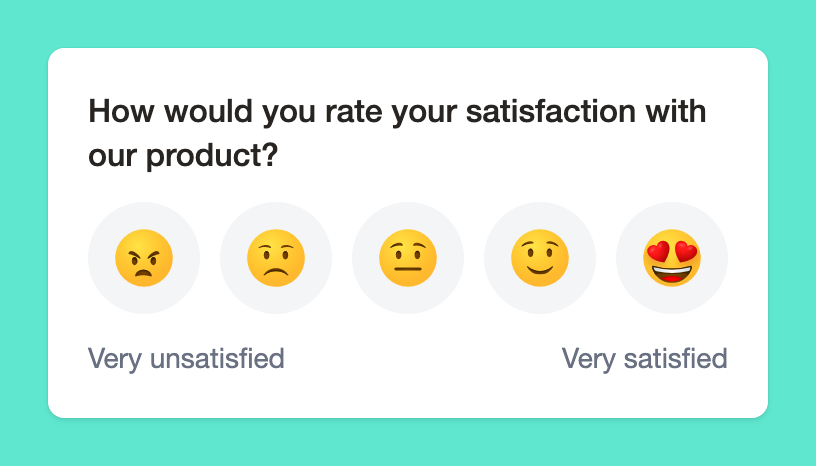
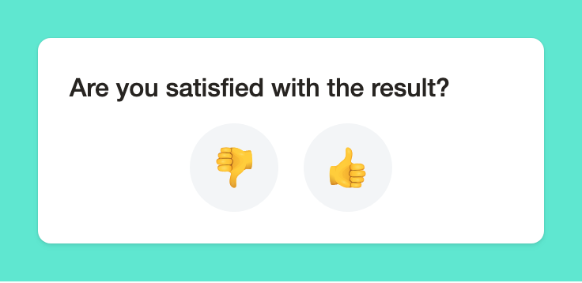
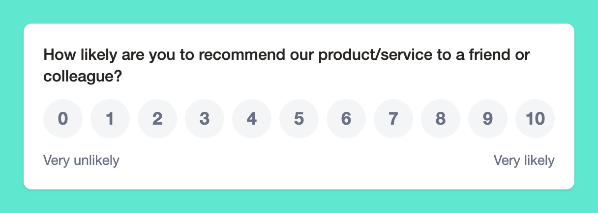
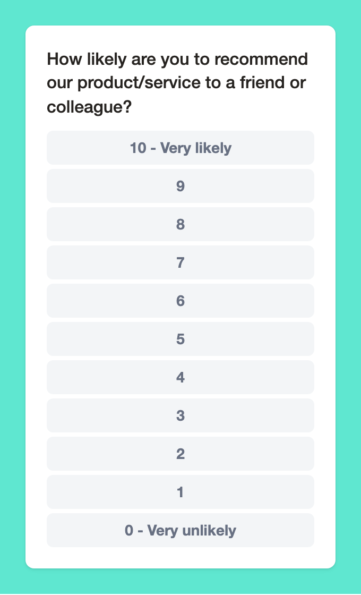
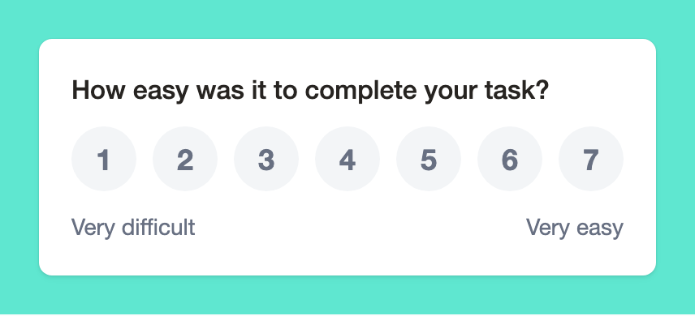
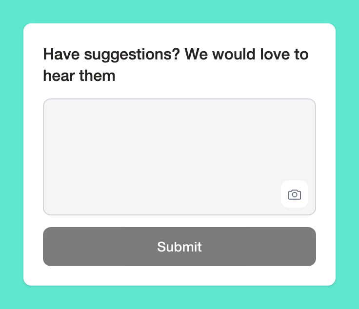
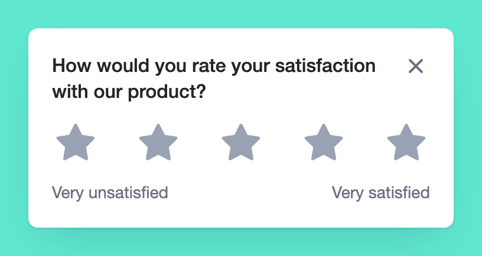

# react-feedback-surveys

[](https://www.npmjs.com/package/react-feedback-surveys)
[](https://www.npmjs.com/package/react-feedback-surveys)
[](https://github.com/feedback-tools-platform/react-feedback-surveys/blob/main/LICENSE)
[](https://bundlephobia.com/package/react-feedback-surveys)
[](https://github.com/feedback-tools-platform/react-feedback-surveys/actions/workflows/ci.yml)
[](https://feedback.tools/react-feedback-surveys/storybook/)

> Lightweight, customizable survey widgets to collect user feedback in React apps.

## Introduction

react-feedback-surveys is a standalone, open-source (MIT) UI library — no backend, no hosting, no
account required. Render the components, wire `onScoreSubmit`/`onFeedbackSubmit` to your own backend
(or nowhere at all).

Want AI-generated insights, a hosted dashboard, and response storage without building your own backend?
Check out [feedback.tools](https://feedback.tools) — built by the same team.

## Table of Contents

- [Introduction](#introduction)
- [Features](#features)
- [Survey Types](#survey-types)
- [Installation](#installation)
    * [1. Install](#1-install)
    * [2. Styles](#2-styles)
- [Survey Component](#survey-component)
    * [CSAT (Customer Satisfaction Score)](#csat-customer-satisfaction-score)
    * [NPS (Net Promoter Score)](#nps-net-promoter-score)
    * [CES (Customer Effort Score)](#ces-customer-effort-score)
- [Layout Components](#layout-components)
    * [Popup](#popup)
    * [Surface](#surface)
- [Props](#props)
    * [Shared Props](#shared-props)
    * [Accessibility Labels](#accessibility-labels)
    * [Attachments](#attachments)
    * [Format Props](#format-props)
    * [Scale Style Options](#scale-style-options)
- [Styling](#styling)
    * [How Styles Combine](#how-styles-combine)
    * [Themes (Dark Mode)](#themes-dark-mode)
    * [CSS Variables](#css-variables)
    * [Custom Classes](#custom-classes)
    * [Shadow DOM Parts](#shadow-dom-parts)
- [Demo](#demo)
- [Contributing](#contributing)
    * [Local development (Storybook)](#local-development-storybook)
    * [Library build (watch mode)](#library-build-watch-mode)
    * [Production build](#production-build)
- [Roadmap](#roadmap)
- [Changelog](#changelog)
- [Credits](#credits)
- [License](#license)


## Features

- **A single `Survey` component** – the format (methodology, scale length, visual style) is configuration, not a different import
- **Ready-to-use survey formats** – CSAT (2 or 5 points), CES (7 points), NPS (0–10)
- **Multiple scale styles** – emoji, stars, numbers, thumbs
- **Flexible placement** – embed inline or display as popup overlay
- **Follow-up feedback** – optional text input or multiple choice responses
- **Optional email collection** – close the loop by capturing a respondent's email when no user identity is known
- **Optional screenshot attachments** – let respondents attach a screenshot, captured by a function you provide
- **Built-in themes** – light, dark, and auto (follows the system color scheme)
- **Fully customizable** – CSS variables and custom class names that always win over the defaults
- **Zero dependencies**
- **TypeScript support**

## Survey Types

`Survey` covers four feedback methodologies, selected with the `type` prop. `CSAT` is the only one with a variable scale length, set via `points`:

- **CSAT (Customer Satisfaction Score):** `type="csat"`, 2-point or 5-point scale (`points={2}` or `points={5}`)
- **NPS (Net Promoter Score):** `type="nps"`, fixed 0–10 scale
- **CES (Customer Effort Score):** `type="ces"`, fixed 7-point scale
- **General (text feedback only):** `type="general"`, no rating scale — see [General](#general-text-feedback-only)

## Installation

### 1. Install

```shell
npm i react-feedback-surveys
# or
yarn add react-feedback-surveys
```

### 2. Styles

```tsx
import 'react-feedback-surveys/index.css';
```

## Survey Component

Every format is reached through the same `Survey` import — `type` and `points` pick the methodology and scale length, `scaleStyle` picks the visual style. See [Format Props](#format-props) for the full matrix of valid `type`/`points`/`scaleStyle` combinations.

### CSAT (Customer Satisfaction Score)

Surveys to ask users about their overall satisfaction, or about a specific feature or flow.

**Example questions:**
- "How satisfied are you with our product?"
- "Was this search helpful?"
- "Are you satisfied with the checkout process?"



```tsx
import { Survey } from 'react-feedback-surveys';
import 'react-feedback-surveys/index.css';

<Survey
  type="csat"
  points={5}
  scaleStyle="emoji"
  question="How would you rate your satisfaction with our product?"
  minLabel="Very unsatisfied"
  maxLabel="Very satisfied"
  responseType="text"
  textQuestion="We'd love to hear your thoughts — what can we improve?"
  textButtonSendLabel="Send"
  textButtonSkipLabel="Skip"
  thankYouMessage="Thanks for your feedback!"
  onScoreSubmit={({ value }) => {/* ... */}}
  onFeedbackSubmit={({ value, text }) => {/* ... */}}
/>
```



```tsx
<Survey
  type="csat"
  points={2}
  scaleStyle="thumbs"
  question="Are you satisfied with the result?"
  responseType="text"
  textQuestion="We'd love to hear your thoughts — what can we improve?"
  textButtonSendLabel="Send"
  textButtonSkipLabel="Skip"
  thankYouMessage="Thank you for your feedback!"
  onScoreSubmit={({ value }) => {/* ... */}}
  onFeedbackSubmit={({ value, text }) => {/* ... */}}
/>
```

`points={5}` → `scaleStyle`: `emoji` | `numbers` | `stars`. `points={2}` → `scaleStyle`: `emoji` | `thumbs`.

### NPS (Net Promoter Score)

Surveys to ask users if they'd recommend your product. Fixed 0–10 scale — no `points` prop needed.

**Example questions:**
- "How likely are you to recommend us to a friend or colleague?"
- "On a scale of 0-10, would you recommend our service?"
- "How likely are you to recommend this product to others?"





```tsx
import { Survey } from 'react-feedback-surveys';
import 'react-feedback-surveys/index.css';

<Survey
  type="nps"
  scaleStyle="numbers"
  question="How likely are you to recommend our product/service to a friend or colleague?"
  minLabel="Very unlikely"
  maxLabel="Very likely"
  responseType="text"
  textQuestion="We'd love to hear your thoughts — what can we improve?"
  textButtonSendLabel="Send"
  textButtonSkipLabel="Skip"
  thankYouMessage="Thank you for your feedback!"
  onScoreSubmit={({ value }) => {/* ... */}}
  onFeedbackSubmit={({ value, text }) => {/* ... */}}
/>
```

`scaleStyle`: `numbers`.

### CES (Customer Effort Score)

Surveys to ask users how easy it is to use your product. Fixed 7-point scale — no `points` prop needed.

**Example questions:**
- "How easy was it to complete your task?"
- "How much effort did it take to resolve your issue?"
- "How easy was it to sign up for an account?"



```tsx
import { Survey } from 'react-feedback-surveys';
import 'react-feedback-surveys/index.css';

<Survey
  type="ces"
  scaleStyle="numbers"
  question="How easy was it to complete your task?"
  minLabel="Very difficult"
  maxLabel="Very easy"
  responseType="text"
  textQuestion="We'd love to hear your thoughts — what can we improve?"
  textButtonSendLabel="Send"
  textButtonSkipLabel="Skip"
  thankYouMessage="Thank you for your feedback!"
  onScoreSubmit={({ value }) => {/* ... */}}
  onFeedbackSubmit={({ value, text }) => {/* ... */}}
/>
```

`scaleStyle`: `numbers`.

### General (text feedback only)

No rating scale — just text feedback and an optional screenshot. The text feedback step is shown immediately and is the whole survey; there's no `points`/`scaleStyle`/`minLabel`/`maxLabel`/`question` to set.

**Example use cases:**
- A general "Send feedback" or "Report a problem" trigger with no methodology attached.
- Contexts where a numeric rating doesn't make sense.



```tsx
import { Survey } from 'react-feedback-surveys';
import 'react-feedback-surveys/index.css';

<Survey
  type="general"
  textQuestion="Got feedback? We'd love to hear it"
  textButtonSendLabel="Send"
  thankYouMessage="Thank you for your feedback!"
  onFeedbackSubmit={({ text }) => {/* ... */}}
/>
```

`responseType` defaults to `'text'` (also accepts `'choices'`) — it can't be unset, since the text feedback step is the only content the survey has. The step is mandatory: there's no Skip button (`textButtonSkipLabel` is ignored for `type="general"`), and Submit stays disabled until there's something to send.

## Layout Components

### Popup

The `<Popup>` component wraps survey widgets in a fixed overlay that slides in from the screen edge. It includes positioning, animations, and a close button for easy dismissal.



#### Usage

```tsx
import { Popup, Survey } from 'react-feedback-surveys';
import 'react-feedback-surveys/index.css';

<Popup
  animated
  className="custom-popup"
  classNames={{
    surface: 'custom-popup-surface',
    close: 'custom-popup-close'
  }}
  placement="bottomRight"
  onClose={() => console.log('Closed')}
>
  <Survey
    type="csat"
    points={5}
    scaleStyle="stars"
    question="How would you rate your satisfaction?"
    onScoreSubmit={({ value }) => {/* ... */}}
  />
</Popup>
```

#### Props

| Prop         | Type                                                       | Required | Default         | Description                                                        |
|--------------|------------------------------------------------------------|----------|-----------------|--------------------------------------------------------------------|
| `placement`  | `'topLeft' \| 'topRight' \| 'bottomRight' \| 'bottomLeft'` | -        | `'bottomRight'` | Position of the popup relative to the screen edges.                |
| `animated`   | `boolean`                                                  | -        | `true`          | Enables a fade-in animation when the popup appears.                |
| `theme`      | `'light' \| 'dark' \| 'auto'`                               | -        | `'light'`       | Built-in color theme, inherited by the survey inside. See [Themes](#themes-dark-mode). |
| `className`  | `string`                                                   | -        | -               | Additional CSS class name for the popup container.                 |
| `classNames` | `{ surface?: string; close?: string }`                     | -        | -               | Class names for the card inside the popup and its close button. `className` styles the popup itself. |
| `children`   | `React.ReactNode`                                          | -        | -               | Content to render inside the popup (typically a survey component). |
| `closeLabel` | `string`                                                    | -        | `'Close survey'` | Close button label, used for both its `aria-label` and `title`.   |
| `onClose`    | `() => void`                                               | -        | -               | Callback fired when the close button is clicked.                   |

For more examples, check out the Storybook stories under `widgets/Survey` (grouped by CSAT/NPS/CES in the sidebar).

> **Note**
> If the survey inside uses `dir="rtl"` on a page that's otherwise LTR (or vice versa), pass the same `dir` to `Popup` too — the close button's position resolves against the document direction, while the survey head's reserved offset resolves against the survey's own `dir`. Passing both keeps them aligned.

### Surface

The `<Surface>` component is a basic container wrapper that provides consistent styling for survey content. It's used internally by the Popup component and can be used standalone to display surveys with a card-like appearance.

The Surface component provides:
- Background color with depth/elevation (box shadow, controlled via `--ft-surface-shadow`)
- Rounded corners (controlled via `--ft-surface-radius`)
- Responsive padding that adapts to mobile devices

#### Usage

```tsx
import { Surface, Survey } from 'react-feedback-surveys';
import 'react-feedback-surveys/index.css';

<Surface className="custom-surface">
  <Survey
    type="csat"
    points={5}
    scaleStyle="stars"
    question="How would you rate your satisfaction?"
    onScoreSubmit={({ value }) => {/* ... */}}
  />
</Surface>
```

#### Props

| Prop        | Type              | Required | Default | Description                                        |
|-------------|-------------------|----------|---------|----------------------------------------------------|
| `className` | `string`          | -        | -       | Additional CSS class name for the surface container.|
| `theme`     | `'light' \| 'dark' \| 'auto'` | - | `'light'` | Built-in color theme, inherited by the survey inside. See [Themes](#themes-dark-mode). |
| `children`  | `React.ReactNode` | -        | -       | Content to render inside the surface.              |

The Surface component uses the `--ft-surface-padding`, `--ft-surface-padding-mobile`, `--ft-surface-radius`, and `--ft-surface-shadow` CSS variables for responsive padding, border radius, and shadow. Inside `Popup` it uses `--ft-popup-shadow` instead.

## Props

Most props are shared across every survey format. `type` (and `points`, for CSAT) select the format; `scaleStyle` picks its visual style — see [Format Props](#format-props).

### Shared Props

| Prop               | Type                          | Required | Description                                                                  |
|--------------------|-------------------------------|----------|------------------------------------------------------------------------------|
| `classNames`       | `SurveyClassNames` (see below)| -        | Optional class names to target internal parts.                               |
| `theme`            | `'light' \| 'dark' \| 'auto'` | -       | Built-in color theme. Default `'light'`. Set it on the outermost component (`Popup` or `Surface`) — see [Themes](#themes-dark-mode). |
| `dir`              | `'ltr' \| 'rtl' \| 'auto'`    | -        | Text direction for RTL/LTR language support.                                 |
| `strings`          | `SurveyStrings` (see below)   | -        | Overrides for the library's own aria-labels and other screen-reader-only text. See [Accessibility Labels](#accessibility-labels). |
| `question`         | `string`                      | required (not used for `type="general"`) | Main survey question displayed on the first screen.       |
| `minLabel`         | `string`                      | -        | Left label for the scale. Not used for `type="general"`.                     |
| `maxLabel`         | `string`                      | -        | Right label for the scale. Not used for `type="general"`.                    |
| `getScoreLabelSuffix` | `(label: string) => string` | -        | Builds the visible text appended after the first/last numbered scale button when it carries `minLabel`/`maxLabel`. Default `` (label) => ` - ${label}` ``. Applies to the `numbers` scale style (CSAT5, CES, NPS). |
| `responseType`     | `null \| 'text' \| 'choices'` (`'text' \| 'choices'` for `type="general"`, defaults to `'text'`) | -        | Enables optional follow-up feedback.                     |
| `textQuestion`     | `string`                      | -        | Follow-up question displayed when `responseType` is defined.                 |
| `textButtonSendLabel`  | `string`                      | -        | Submit label for the feedback screen.                                        |
| `textButtonSkipLabel`  | `string`                      | -        | Skip label for the feedback screen.                                          |
| `choiceOptions`    | `string[] \| null`            | -        | Predefined choices (when `responseType === 'choices'`).                      |
| `otherPlaceholder` | `string`                      | -        | Placeholder for the free-text input next to choice checkboxes. Default `'Other'`. |
| `thankYouMessage`  | `string`                      | required | Message shown after submission.                                              |
| `collectContact`     | `boolean`                     | -        | Enables an optional email collection step before the success screen.         |
| `userId`           | `string`                      | -        | Existing user identity. When provided, the email collection step is skipped. |
| `contactQuestion`    | `string`                      | -        | Question shown on the email collection screen.                               |
| `contactSubtext`   | `string`                      | -        | Descriptive text shown above the email input.                                |
| `contactButtonSendLabel` | `string`                      | -        | Submit label for the email collection screen.                                |
| `contactButtonSkipLabel`  | `string`                      | -        | Skip label for the email collection screen.                                  |
| `onCaptureScreenshot` | `() => string \| Blob \| Promise<string \| Blob>` | -        | Enables an optional screenshot-attachment control on the feedback step. Hidden unless provided — see [Attachments](#attachments). |
| `screenshotButtonLabel` | `string`                    | -        | Label for the screenshot-attachment control.                                 |
| `screenshotErrorMessage` | `string`                  | -        | Shown to the respondent when `onCaptureScreenshot` fails, whatever it threw or rejected with. Default `'Failed to capture screenshot'`. |
| `maxAttachments`   | `number`                      | -        | Maximum number of attachments a respondent may confirm. Default `1`. See [Attachments](#attachments). |
| `attachmentCaption` | `string`                     | -        | Visible caption under an attachment thumbnail, also used as its image alt text. Default `'Screenshot'`. |

### Accessibility Labels

A handful of internal aria-labels ship with an English default. These are never visible UI copy (that's `question`, `thankYouMessage`, `otherPlaceholder`, `attachmentCaption`, etc., always authored by you, listed alongside the rest of the shared props above) — every key in `strings` is announced to assistive tech only, useful to override if you're localizing a survey for a non-English audience.

Pass a `strings` object with only the keys you want to change — each one merges over its own English default, so there's no need to repeat the rest:

```tsx
<Survey
  /* ... */
  strings={{
    emailLabel: 'Adresse e-mail',
    getScoreLabel: (score) => `Score ${score}`
  }}
/>
```

#### SurveyStrings Type

| Key | Type | Default |
|-----|------|---------|
| `feedbackFormLabel` | `string` | `'Feedback form'` |
| `additionalFeedbackLabel` | `string` | `'Additional feedback'` |
| `yourFeedbackLabel` | `string` | `'Your feedback'` |
| `contactFormLabel` | `string` | `'Contact form'` |
| `emailLabel` | `string` | `'Email address'` |
| `attachmentOpenLabel` | `string` | `'Open screenshot in a new tab'` |
| `attachmentRemoveLabel` | `string` | `'Remove screenshot'` |
| `screenshotProcessingLabel` | `string` | `'Capturing screenshot…'` |
| `screenshotErrorDismissLabel` | `string` | `'Dismiss error'` |
| `getScoreLabel` | `(score: number) => string` | `(score) => \`Score ${score}\`` |
| `getStarsLabel` | `(score: number) => string` | `(score) => \`${score} ${score > 1 ? 'stars' : 'star'}\`` |

`getScoreLabel` applies to the `numbers` scale style (CSAT5, CES, NPS); `getStarsLabel` applies to CSAT5's `stars` style. Both are callbacks rather than templates so you can apply correct pluralization for your target language. `Popup`'s close button label lives on `Popup` itself, not in `strings` — see its own `closeLabel` prop in [Popup Props](#props).

#### SurveyClassNames Type

One flat object, one key per part. See [Custom Classes](#custom-classes) for what each key styles.

```typescript
interface SurveyClassNames {
  root?: string;        // Survey wrapper
  head?: string;        // Row with the title
  title?: string;       // Question, step question or thank-you text
  body?: string;        // Content under the head
  rating?: string;      // Added to root on the rating step
  feedback?: string;    // Added to root on the feedback step
  contact?: string;     // Added to root on the email step
  success?: string;     // Added to root on the success step
  successIcon?: string; // Icon on the success step
  scale?: string;       // Rating scale: the points and the legend
  points?: string;      // Row of rating points
  point?: string;       // Single rating point (button)
  pointIcon?: string;   // Emoji, star or thumb inside a point
  pointIconFilled?: string; // Added to pointIcon while the star is filled
  pointScore?: string;  // Number inside a point
  legend?: string;      // Min and max captions under the scale
  form?: string;        // Form on the feedback and email steps
  subtext?: string;     // Text above the email field
  choices?: string;     // List of predefined choices
  choice?: string;      // Single choice (the clickable label)
  checkbox?: string;    // Visible checkbox square of a choice
  field?: string;       // Every text field: feedback textarea, "Other" input, email input
  attach?: string;      // Screenshot capture button
  attachment?: string;  // Attached screenshot row
  remove?: string;      // Button that removes an attachment
  error?: string;       // Capture error row
  dismiss?: string;     // Button that hides the capture error
  actions?: string;     // Wrapper for the submit and skip buttons
  submit?: string;      // Submit button
  skip?: string;        // Skip button
  choiceChecked?: string;   // Added to choice while it is checked
  checkboxChecked?: string; // Added to checkbox while its choice is checked
  fieldInvalid?: string;    // Added to field while it shows a validation error
  attachBusy?: string;      // Added to attach while a screenshot is captured
}
```

### Shared Events

| Prop               | Type                                              | Required | Description                                                                                                 |
|--------------------|---------------------------------------------------|----------|-------------------------------------------------------------------------------------------------------------|
| `onScoreSubmit`    | `(payload: ScorePayload) => void \| Promise<void>`       | -        | Fires immediately when a score is selected, before any follow-up feedback screen. Captures the raw rating.  |
| `onFeedbackSubmit` | `(payload: FeedbackPayload) => void \| Promise<void>` | -        | Fires when feedback is submitted. Includes the selected score and the user's text(s). |
| `onContactSubmit`  | `(payload: ContactPayload) => void \| Promise<void>` | -        | Fires when the respondent submits an email on the optional email collection screen. Not called when the step is skipped or not shown. |

**Event Payload Types:**

```typescript
type ScorePayload = { value: number };
type FeedbackPayload = { value?: number; text?: string | string[]; attachments?: Attachment[] };
type ContactPayload = { value?: number; text?: string | string[]; email: string };
type Attachment = { kind: 'screenshot'; data: string | Blob; name?: string; mimeType?: string; size?: number };
```

> See [Attachments](#attachments).

> **Event behavior**

#### `onScoreSubmit`

Invoked immediately when the user selects a score on the rating scale — this callback runs *before* any optional follow-up screen is shown.  
Use it to persist the rating instantly.  
The actual `value` returned depends on the survey type:

- **CSAT2:** `0–1`
- **CSAT5:** `1–5`
- **CES7:** `1–7`
- **NPS10:** `0–10`

#### `onFeedbackSubmit`

Invoked when the user completes the follow-up step and submits their feedback (only applies when `responseType` is `text` or `choices`).  
This callback provides both the original score and the user's input.

For surveys with a rating step, the feedback step is optional: respondents can submit feedback or skip it via the `textButtonSkipLabel` button (or by submitting with empty input), and either action advances to the next screen. For `type="general"`, the feedback step **is** the survey, so there's no Skip button — Submit stays disabled until there's something to send. `onFeedbackSubmit` only fires when feedback text or choices are actually submitted; it is **not** called when a rating-survey's step is skipped.

**Arguments:**
- `value?: number` — the same score previously passed to `onScoreSubmit`; `undefined` for `type="general"`, which has no rating step
- `text: string | string[]` — depends on `responseType`:
    - `text`: a single text feedback string
    - `choices`: an array of selected options (may include free-text feedback if enabled)
- `attachments?: Attachment[]` — present when the respondent confirmed a screenshot; see [Attachments](#attachments)

> **Important**  
You should listen to **both** `onScoreSubmit` and `onFeedbackSubmit`.  
A user may select a score but abandon the follow-up screen (close the widget, navigate away, refresh, etc.).  
Handling both events ensures you capture at least the rating even when additional feedback is not provided — and still receive extended data when it is.

#### `onContactSubmit`

When `collectContact` is `true` and no `userId` is provided, an optional email collection screen is shown after the rating/feedback screens and before the success screen. This lets you "close the feedback loop" by capturing an email for a respondent whose identity isn't already known to the host app.

- If `userId` is provided, the step is skipped entirely — the widget assumes identity is already known.
- The step is always optional: respondents can submit an email or skip it, and either action advances to the success screen.
- `onContactSubmit` only fires when the respondent actually submits an email; it is **not** called when the step is skipped or not shown.

**Arguments:**
- `value?: number` — the selected rating, if any.
- `text?: string | string[]` — the submitted feedback text or choices, if any.
- `email: string` — the email address entered by the respondent.

```tsx
<Survey
  type="csat"
  points={5}
  scaleStyle="numbers"
  question="How would you rate your satisfaction with our product?"
  responseType="text"
  textQuestion="We'd love to hear your thoughts — what can we improve?"
  thankYouMessage="Thanks for your feedback!"
  collectContact
  userId={currentUser?.id}
  contactQuestion="Mind sharing your email so we can follow up?"
  contactButtonSendLabel="Submit"
  contactButtonSkipLabel="Skip"
  onScoreSubmit={({ value }) => {/* ... */}}
  onFeedbackSubmit={({ value, text }) => {/* ... */}}
  onContactSubmit={({ value, text, email }) => {/* attribute the feedback to this email */}}
/>
```

### Attachments

Respondents can attach a screenshot to their feedback, surfaced on submit as `attachments?: Attachment[]` (see the event payload types above). Each attachment renders as a thumbnail in the feedback step, with a caption and size underneath, click to open it in a new tab, click the "x" to remove it. Submit is disabled for the brief moment a capture is still in flight, so it can't be confirmed before the attachment actually lands in the list.

Once an attachment is confirmed, the Skip button is disabled — an attached screenshot is never silently discarded. Remove the attachment to re-enable Skip, or submit to keep it. After a rating, an attachment on its own is enough to submit: `onFeedbackSubmit` receives it with `text: undefined`. A `general` survey has no rating, so there it is not: for `responseType="text"`, submitting with an attachment but no text flags the textarea instead of sending; for `responseType="choices"`, Submit stays disabled until a choice is picked or text is entered.

By default a respondent can confirm a single attachment: once one is attached, the add control hides. Pass `maxAttachments` to raise (or lower) that cap. The add control stays visible (below the existing thumbnails) until the cap is reached:

```tsx
<Survey
  /* ... */
  onCaptureScreenshot={() => domToDataUrl(document.body)}
  maxAttachments={3}
/>
```

Pass `onCaptureScreenshot` to add an "Capture screenshot" control to the feedback step. Clicking it calls your function and attaches the result immediately. The control is off by default: it doesn't render at all unless `onCaptureScreenshot` is provided.

While the capture is pending, the control shows a spinner. If your function throws or rejects, nothing is attached and the respondent sees `screenshotErrorMessage` — never the error's own text — with a button to dismiss it; the next capture attempt clears it too. The library doesn't time out a pending capture, so put a time limit inside your function if it can hang.

Capturing a screenshot needs an actual DOM-to-image library (or a native bridge in a hybrid app) — real, non-trivial code that most consumers of this package won't want to pay for in bundle size if they don't use the feature. So react-feedback-surveys deliberately doesn't ship a capture implementation itself: bring your own function that returns the captured image (as a data URL string, a `Blob`, or a `Promise` of either). A drop-in recipe using [modern-screenshot](https://github.com/qq15725/modern-screenshot):

```shell
npm i modern-screenshot
```

```tsx
import { Survey } from 'react-feedback-surveys';
import { domToDataUrl } from 'modern-screenshot';
import 'react-feedback-surveys/index.css';

<Survey
  type="csat"
  points={5}
  scaleStyle="numbers"
  question="How would you rate your satisfaction with our product?"
  responseType="text"
  textQuestion="We'd love to hear your thoughts — what can we improve?"
  thankYouMessage="Thanks for your feedback!"
  onCaptureScreenshot={() => domToDataUrl(document.body)}
  onScoreSubmit={({ value }) => {/* ... */}}
  onFeedbackSubmit={({ value, text, attachments }) => {/* attachments?.[0]?.data holds the attached screenshot */}}
/>
```

In a hybrid app, `onCaptureScreenshot` can just as well call into a native bridge (e.g. `WKWebView.takeSnapshot` on iOS) instead of a DOM-to-image library.

> **Note**  
> DOM-to-image capture is best-effort — fonts, cross-origin images, and some CSS effects may not render identically on every browser (particularly Safari/iOS). The respondent can open the attached thumbnail in a new tab to check it, and remove it with one click if the capture came out wrong.

### Format Props

| Prop | Type | Required | Description |
|------|------|----------|--------------|
| `type` | `'csat'` \| `'nps'` \| `'ces'` \| `'general'` | required | Survey methodology. Determines the scale range and which `scaleStyle`/`points` combinations are valid. `'general'` has no scale at all — see [General](#general-text-feedback-only). |
| `points` | `2` \| `5` | required for `type="csat"`; not used otherwise | Number of points on the scale. `nps` is a fixed 0–10 scale and `ces` a fixed 1–7 scale, so neither takes `points`. |

### Scale Style Options

Valid `scaleStyle` values depend on `type` (and `points`, for CSAT):

| `type` | `points` | Scale range | Valid `scaleStyle` |
|--------|----------|-------------|---------------------|
| `csat` | `5` | 1–5 | `'emoji'` (5 emotion levels) \| `'numbers'` \| `'stars'` (1–5 stars) |
| `csat` | `2` | 0–1 | `'emoji'` (happy/sad faces) \| `'thumbs'` (thumbs up/down) |
| `ces`  | — | 1–7 | `'numbers'` |
| `nps`  | — | 0–10 | `'numbers'` |

Invalid combinations (e.g. `type="ces"` with `scaleStyle="stars"`) are rejected at the type level.

## Styling

The package ships with minimal default styles. To use them:

```tsx
import 'react-feedback-surveys/index.css';
```

### How Styles Combine

Three rules define every override:

1. **Library styles are defaults.** All of them live in one CSS cascade layer, `@layer react-feedback-surveys`. Any CSS of yours outside a layer wins over them, whatever its specificity and load order. A plain `.my-button` beats the library's `.button:hover:not(:disabled)`.
2. **Values flow through variables.** Colors, radius, shadows, and font come from CSS variables. From weakest to strongest: library defaults → the `theme` prop → your `--ft-*` variables. `--ft-*` set on any ancestor reach the widget, also across a shadow DOM boundary.
3. **Rules come from classes.** `className` and `classNames` attach your classes to specific parts. A class that sets a color itself owns that color in every theme — the built-in theme does not adjust it.

If your own CSS uses cascade layers, layer order decides instead of rule 1:

- **Tailwind CSS v4** — import the styles into the `components` layer from your CSS entry instead of JavaScript, so they beat Preflight and utilities beat them:

  ```css
  @import "tailwindcss";
  @import "react-feedback-surveys/index.css" layer(components);
  ```

- **A global reset outside layers** (normalize, Bootstrap Reboot, `* { margin: 0 }`) also wins over the defaults, the same as your classes do. Move it into a layer declared before the library's. Layer order is fixed by first appearance, so import the library styles from this same file, not from JavaScript:

  ```css
  @layer reset, react-feedback-surveys;
  @import "bootstrap/dist/css/bootstrap-reboot.css" layer(reset);
  @import "react-feedback-surveys/index.css";
  ```

Inside a shadow root page styles don't reach the widget, so only the CSS you put in that root takes part. To style it from the page, use [Shadow DOM Parts](#shadow-dom-parts).

### Themes (Dark Mode)

The `theme` prop switches the built-in color palette. No CSS is needed on your side.

| Value     | Result                                                                  |
|-----------|-------------------------------------------------------------------------|
| `'light'` | Default palette. Same as leaving the prop out.                          |
| `'dark'`  | Ready dark palette.                                                     |
| `'auto'`  | Follows the visitor's system color scheme and switches when it changes. |

```tsx
<Popup theme="auto">
  <Survey /* ... */ />
</Popup>
```

- **Set it on the outermost component** — `Popup` or `Surface`. Components inside inherit the theme. A `theme` on `Survey` alone doesn't recolor the `Surface` around it.
- **The nearest `theme` wins.** `theme="light"` inside a `theme="dark"` component restores the light palette.
- **`auto` is pure CSS** (`prefers-color-scheme`), so there's no flash of the wrong theme with server rendering.
- **Your `--ft-*` variables always win over the built-in theme**, wherever you set them.

To toggle the theme from your own switcher, pass its state to the prop: `<Popup theme={isDark ? 'dark' : 'light'}>`.

#### Custom Themes

A custom theme is a class that sets `--ft-*` variables, plus optional classes for single parts:

```css
.brand-theme {
  --ft-color-text: 250 60% 20%;
  --ft-color-bg: 250 100% 98%;
  --ft-surface-radius: 0;
}

.brand-submit {
  text-transform: uppercase;
}
```

```tsx
<Surface className="brand-theme">
  <Survey
    classNames={{ submit: 'brand-submit' }}
    /* ... */
  />
</Surface>
```

Storybook's `Themes` section shows the built-in themes and a catalog of custom ones (`src/stories/themes`), each paired with a use case. Catalog themes are written for a widget inside a shadow root, see [Shadow DOM Parts](#shadow-dom-parts). The `Styling` section demonstrates how the rules above combine.

### CSS Variables

You can override colors and fonts via CSS variables:

```css
:root {
  /* Main text color for headings and body text */
  --ft-color-text: 30 8% 14%;

  /* Background color for survey widgets */
  --ft-color-bg: 0 0% 100%;

  /* Muted text color for labels and secondary content */
  --ft-color-muted: 222 11% 46%;

  /* Error color for validation messages */
  --ft-color-error: 32 95% 44%;

  /* Error text color (attachment capture errors) — darker than --ft-color-error, tuned for text contrast rather than borders/outlines */
  --ft-color-error-text: 32 95% 32%;

  /* Border color for inputs and containers */
  --ft-color-border: 214 14% 83%;

  /* Outline color for focused interactive elements */
  --ft-color-outline: 218 14% 65%;

  /* Shadow color for the default --ft-surface-shadow and --ft-popup-shadow */
  --ft-color-shadow: 0 0% 0%;

  /* Background color for input controls and buttons */
  --ft-color-control: 214 20% 96%;

  /* Z-index for popup overlay positioning */
  --ft-popup-z-index: 49;

  /* Box shadow of the Popup container; a custom value replaces all layers, `none` removes it */
  /* The default is the Surface shadow plus a wider layer that lifts the popup above the page */
  --ft-popup-shadow:
    0 0 1px hsl(0 0% 0% / 12%),
    0 1px 2px hsl(0 0% 0% / 6%),
    0 2px 4px hsl(0 0% 0% / 4%),
    0 16px 40px -12px hsl(0 0% 0% / 14%);

  /* Padding for Surface component container (desktop) */
  --ft-surface-padding: 20px;

  /* Padding for Surface component container on mobile devices (max-width: 400px) */
  --ft-surface-padding-mobile: 20px;

  /* Border radius for Surface container, inputs, and submit button */
  --ft-surface-radius: 8px;

  /* Box shadow of the Surface container (inline surveys); a custom value replaces all layers, `none` removes it */
  --ft-surface-shadow:
    0 0 1px hsl(0 0% 0% / 12%),
    0 1px 2px hsl(0 0% 0% / 6%),
    0 2px 4px hsl(0 0% 0% / 4%);

  /* Font of all survey text, inputs, and buttons */
  --ft-font-family: 'Helvetica Neue', 'Arial Nova', Helvetica, Arial, sans-serif;

  /* Primary action: the submit button and a checked checkbox. Defaults to --ft-color-text */
  --ft-color-accent: 30 8% 14%;

  /* Text and check mark on top of the accent. Defaults to --ft-color-bg */
  --ft-color-accent-text: 0 0% 100%;

  /* Fill of a highlighted star in the stars scale */
  --ft-color-star: 42 99% 64.5%;

  /* Size of a choice checkbox; the box stays centered on the first text line at any size */
  --ft-checkbox-size: 20px;
}

/* Use with hsl() function: */
/* color: hsl(var(--ft-color-text)); */
/* background: hsl(var(--ft-color-bg)); */
/* box-shadow: 0 2px 4px hsl(var(--ft-color-shadow) / 4%); */
```

### Custom Classes

`Survey` accepts a flat `classNames` object: one key per part. Your classes win over the library defaults — see [How Styles Combine](#how-styles-combine). Every part also carries a `part` attribute with the same name in kebab case, for styling it inside a shadow root — see [Shadow DOM Parts](#shadow-dom-parts).

Names follow four rules: buttons are named by their action (`submit`, `skip`, `attach`, `remove`, `dismiss`), lists are plural and their items singular (`choices` → `choice`, `points` → `point`), a part inside another part takes its name as a prefix (`point-icon`, `success-icon`), and a state is the part's name plus an adjective (`checkboxChecked`, `fieldInvalid`), so each state class lands on exactly one part.

| Key           | Part           | Applies to                                               |
|---------------|----------------|----------------------------------------------------------|
| `root`        | `root`         | Survey wrapper                                           |
| `head`        | `head`         | Row with the title                                       |
| `title`       | `title`        | Question, step question or thank-you text                |
| `body`        | `body`         | Content under the head                                   |
| `successIcon` | `success-icon` | Icon on the success step                                 |
| `scale`       | `scale`        | Rating scale: the points and the legend                  |
| `points`      | `points`       | Row of rating points                                     |
| `point`       | `point`        | Single rating point (button)                             |
| `pointIcon`   | `point-icon`   | Emoji, star or thumb inside a point                      |
| `pointScore`  | `point-score`  | Number inside a point                                    |
| `legend`      | `legend`       | Min and max captions under the scale                     |
| `form`        | `form`         | Form on the feedback and email steps                     |
| `subtext`     | `subtext`      | Text above the email field                               |
| `choices`     | `choices`      | List of predefined choices                               |
| `choice`      | `choice`       | Single choice (the clickable label)                      |
| `checkbox`    | `checkbox`     | Visible checkbox square of a choice                      |
| `field`       | `field`        | Every text field: feedback textarea, "Other" input, email input |
| `attach`      | `attach`       | Screenshot capture button                                |
| `attachment`  | `attachment`   | Attached screenshot row                                  |
| `remove`      | `remove`       | Button that removes an attachment                        |
| `error`       | `error`        | Capture error row                                        |
| `dismiss`     | `dismiss`      | Button that hides the capture error                      |
| `actions`     | `actions`      | Wrapper for the submit and skip buttons                  |
| `submit`      | `submit`       | Submit button                                            |
| `skip`        | `skip`         | Skip button                                              |

The layout components have their own: `Popup`'s `className` styles the popup (part `popup`), `Popup`'s `classNames.surface` and `Surface`'s `className` style the card (part `surface`), and `Popup`'s `classNames.close` styles the close button (part `close`).

Form keys apply to both the feedback and the email step. To style one step only, scope the rule with a step key.

State and step keys add a class next to the part's own while it is in that state, so combine the two:

| Key                                         | Added to             | While                          |
|---------------------------------------------|----------------------|--------------------------------|
| `choiceChecked`                             | `choice`             | The choice is checked          |
| `checkboxChecked`                           | `checkbox`           | Its choice is checked          |
| `fieldInvalid`                              | `field`              | The field shows an error       |
| `attachBusy`                                | `attach`             | A screenshot is being captured |
| `pointIconFilled`                           | `pointIcon`          | The star is filled (stars scale only) |
| `rating`, `feedback`, `contact`, `success` | `root`               | That step is shown             |

A disabled button needs no key: use `.my-submit:disabled`.

```tsx
import { Survey } from 'react-feedback-surveys';
import 'react-feedback-surveys/index.css';

<Survey
  classNames={{
    point: 'my-point',
    choice: 'my-choice',
    checkbox: 'my-checkbox',
    checkboxChecked: 'my-checkbox-checked',
    submit: 'my-submit'
  }}
  type="csat"
  points={5}
  scaleStyle="numbers"
  question="How would you rate your satisfaction with our product?"
  minLabel="Very unsatisfied"
  maxLabel="Very satisfied"
  onScoreSubmit={({ value }) => {/* ... */}}
  onFeedbackSubmit={({ value, text }) => {/* ... */}}
/>
```

```css
.my-point { border-radius: 10px; }
.my-checkbox-checked { background-color: #6d4aff; }
.my-submit:disabled { opacity: 0.4; }
```

### Shadow DOM Parts

When the widget renders inside a shadow root (as the Feedback Tools SDK does), page CSS can't reach its classes. Every part carries a [`part`](https://developer.mozilla.org/en-US/docs/Web/CSS/::part) attribute instead, so page CSS styles it through the shadow host with `::part()`:

```css
.my-host {
  --ft-color-bg: 250 70% 97%;
  --ft-surface-radius: 18px;
}

.my-host::part(submit) {
  color: #fff;
  background-color: #6d4aff;
  border-radius: 999px;
}

.my-host::part(choice checked) {
  background-color: #ede9fe;
}
```

Part names are the `classNames` keys in kebab case, plus `popup`, `surface`, and `close` from the layout components. The full list is in [Custom Classes](#custom-classes).

States come as a second part name, because `::part()` can't look at attributes or neighbours:

| State                           | Selector                       |
|---------------------------------|--------------------------------|
| Checked choice                  | `::part(choice checked)`, `::part(checkbox checked)` |
| Invalid text field              | `::part(field invalid)`        |
| Screenshot capture in progress  | `::part(attach busy)`          |
| Filled star                     | `::part(point-icon filled)`    |
| Current step                    | `::part(root rating)`, `feedback`, `contact`, `success` |

Pseudo-classes and pseudo-elements of the part itself work: `:hover`, `:focus-visible`, `:disabled`, `::before`, `::after`, `::placeholder`. Selectors that look inside or around a part don't: no `:has()`, no `::part(a) .child`, no `::part(a) + ::part(b)`.

## Demo

- Live demo: [View Storybook](https://feedback.tools/react-feedback-surveys/storybook/)
- Run locally: `npm run storybook`

## Contributing

### Local development (Storybook)

```bash
npm i
npm run storybook
```

Storybook runs at http://localhost:6006 and is the recommended way to develop and review components.

### Library build (watch mode)

```bash
npm run dev
```

This builds the package to `dist/` and watches for changes.

### Production build

```bash
npm run build
```

## Roadmap

- [ ] Custom emoji & icon support

## Changelog

For a detailed history of changes, see the [Changelog](https://feedback.tools/react-feedback-surveys/docs/changelog).

## Credits

Emoji icons used in this package are from [Sensa Emoji](https://sensa.co/emoji) — thanks to the Sensa team for creating such a great set of expressive icons.

## License

MIT © [feedback.tools](https://feedback.tools)
